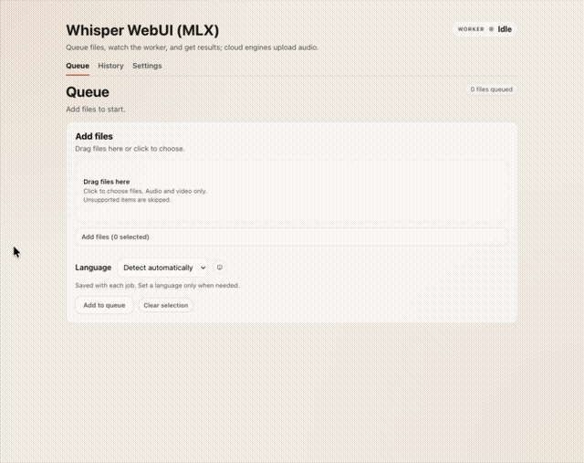

# mlx-ui

Local-first transcription web UI with a sequential queue, per-job engine
selection, and a truthful multi-engine runtime model. The app runs on
`127.0.0.1`, stores its queue/history locally, and can process jobs with local
or cloud engines depending on what you install and select.

## Demo


## Origin / inspiration
This repo’s core idea and MLX backend flow are based on JosefAlbers’s
`whisper-turbo-mlx` project:
```text
https://github.com/JosefAlbers/whisper-turbo-mlx
```

## Features
- Localhost-only FastAPI + Jinja2 UI for queue, history, settings, and preview
- Sequential worker with per-job `requested_engine` and `effective_engine`
- Shared transcript writers for `.txt`, `.json`, `.srt`, and `.vtt` when the
  backend provides real timing data
- Batch uploads with an explicit job language (`auto` or a concrete language)
- SQLite job tracking in `data/jobs.db`
- Local readiness metadata for Whisper and Parakeet model caches
- Optional Telegram delivery of `.txt` results (best-effort)
- Startup update check (best-effort, can be disabled)

## Engine matrix

| Engine | Type | Typical environment | Notes |
| --- | --- | --- | --- |
| `whisper_mlx` | Local | macOS Apple Silicon | Best-supported local path via `whisper-turbo-mlx` / Metal |
| `whisper_cpu` | Local | macOS Intel, Docker, fallback on Apple Silicon | CPU-only `openai-whisper` path |
| `parakeet_tdt_v3` | Local | Linux + CUDA + PyTorch + NVIDIA NeMo | Real backend, not part of the macOS bootstrap path |
| `cohere` | Cloud | Any machine with the optional SDK and API key | Sends audio to Cohere; not local/offline |

The UI stays local-first, but it is no longer honest to describe the product as
always local-only. If you select `cohere`, the job runs through Cohere's cloud
API and needs network access plus an explicit supported language.

## Requirements
- Python 3.12.3+
- `ffmpeg`
- Internet access on first run for dependencies and first-run model downloads
- macOS Apple Silicon for the best-supported local MLX path
- macOS Intel or Docker for the CPU Whisper path
- Linux + CUDA if you want the local Parakeet backend
- Optional Cohere account + API key for the cloud engine

## Quick start
```bash
./run.sh
```
Then open http://127.0.0.1:8000.

Bootstrap defaults on macOS:
- Apple Silicon: installs Whisper MLX
- Intel: installs Whisper CPU

Optional profiles:
```bash
./run.sh --with-cohere
./run.sh --with-whisper-cpu
```

You can also call the bootstrap script directly:
```bash
./scripts/setup_and_run.sh --with-cohere
```

The launcher installs missing prerequisites, creates/updates `.venv`, installs
the appropriate dependency profile for the current machine, and starts the app
on `127.0.0.1:8000`. First-run model downloads can still take a while for local
engines that are not already cached.

## Install via curl

You can install the app and a convenient launcher script with a single command:

```bash
curl -fsSL https://raw.githubusercontent.com/ivkhokhlov/whisper-webui-mlx/master/scripts/install.sh | bash
```

This will:

- Clone/update the repo under `~/.local/share/whisper-webui-mlx` (by default)
- Create a `whisper-webui-mlx` launcher in `~/.local/bin`

Make sure `~/.local/bin` is on your `PATH`, then you can start the app with:

```bash
whisper-webui-mlx
```

The launcher forwards bootstrap flags too:
```bash
whisper-webui-mlx --with-cohere
```

## Docker quick start (CPU backend)
Docker runs the CPU Whisper backend (`whisper_cpu`) only. This is slower than
MLX but works as an isolated local fallback. For best performance on Apple
Silicon, use the native `./run.sh` flow. MLX is not available in Docker because
it requires macOS + Metal, and Parakeet is not part of this Docker path.

```bash
./docker-run.sh
```

Then open http://127.0.0.1:8000.

Notes:
- Data, logs, and the Whisper model cache are persisted under `./data`.
- The script cleans up stopped containers for the same image to avoid junk build-up.
- Override settings with env vars (examples below).
- Use `DOCKER_PLATFORM=linux/amd64` on Intel hosts if you need to force a platform.

Example overrides:
```bash
WHISPER_MODEL=base PORT=9000 ./docker-run.sh
```
Note: `TRANSCRIBER_BACKEND=wtm` is not supported in Docker; use `whisper` or
run natively with `./run.sh` for MLX.

## Manual dev loop
```bash
make dev-deps
make run
```

Other useful commands:
```bash
make test
make lint
make fmt
```

## Configuration
- `WTM_PATH` - path to the `wtm` binary if a different one is on PATH
- `WTM_QUICK` - set to `1`/`true` to enable quick mode (default: `false`)
- `TRANSCRIBER_BACKEND` - backend/env override (`wtm`, `whisper`, `cohere`,
  `parakeet_tdt_v3`, `fake`, plus legacy aliases)
- `WHISPER_MODEL` - Whisper model name (default: `large-v3-turbo`)
- `WHISPER_DEVICE` - `cpu` (default) or `cuda` if you extend the image
- `WHISPER_FP16` - set to `1`/`true` to enable fp16 (GPU-only)
- `WHISPER_CACHE_DIR` - override Whisper model cache directory
- `COHERE_API_KEY` - optional Cohere API key
- `COHERE_MODEL` - Cohere transcription model id
- `TELEGRAM_BOT_TOKEN` - optional, for Telegram delivery
- `TELEGRAM_CHAT_ID` - optional, for Telegram delivery
- `LOG_LEVEL` - logging verbosity (default: `INFO`)
- `LOG_DIR` - log directory (default: `data/logs`)
- `DISABLE_UPDATE_CHECK=1` - skip startup update check
- `UPDATE_CHECK_URL` - override update check URL
- `SKIP_MODEL_DOWNLOAD=1` - skip model download in `scripts/setup_and_run.sh`

## Data locations
- `data/uploads/` - uploaded files
- `data/results/` - transcription outputs by job ID
- `data/jobs.db` - SQLite job metadata
- `data/logs/` - log files for debugging
- `data/.cache/whisper/` - optional local Whisper cache (Docker/backend-dependent)
- `~/.cache/huggingface/` - typical Parakeet cache location when used locally

## Notes
- The server binds to `127.0.0.1` only.
- Jobs persist the selected language plus the requested and effective engine.
- Local engines can work offline after setup and model download.
- The `cohere` engine is intentionally not offline and will upload audio to
  Cohere for transcription.
- Telegram delivery and update checks are best-effort and never block the queue.
